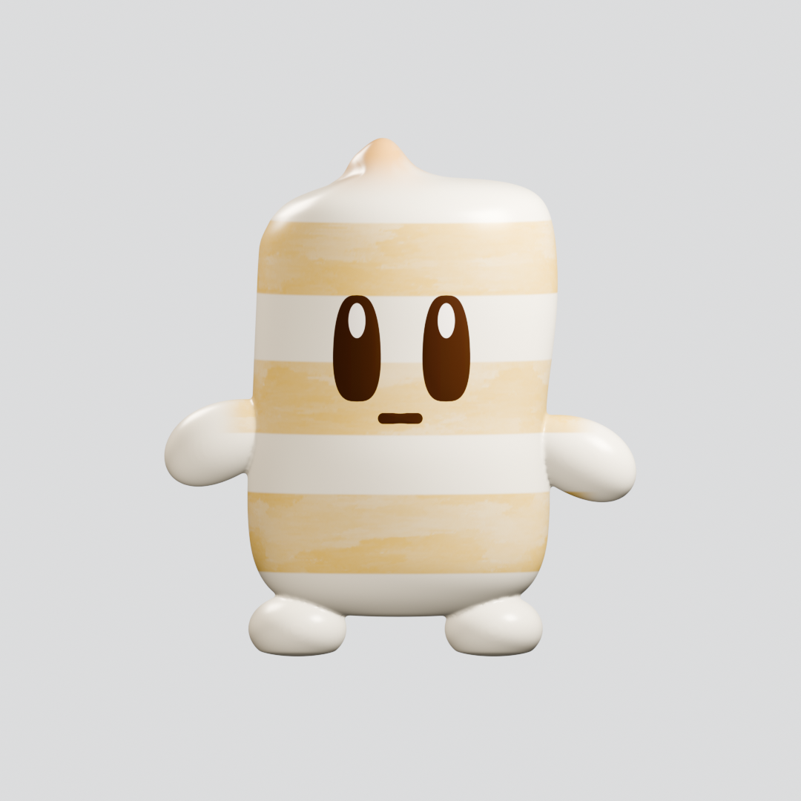

# やくみ組 3Dモデル

しょうがちゃん・にんにくの承認済みモデルと、追加キャラクター9体を配布しています。
最新版 **v1.2.0** のにんにくは手足を持たず、本体と顔が一緒に跳ね・傾きます。
しょうがちゃんの元の手足とリグ、両者の本体・顔・塗装は保持しています。
両者の動作動画は元のBlenderモデルから1080×1080・24fps・4秒で再レンダーしました。

**モデル・材質・塗装画像・リグ・独自アニメーション・動画・独自コードはCC0です。
商用利用・改変・再配布を許可します。許可申請とクレジット表記は不要です。**
Three.jsはMITライセンスを保持しています。

## ダウンロード

| モデルセット | 内容 | Release |
|---|---|---|
| しょうが・にんにく 最新修正版 | にんにくの手足を除去、本体の跳ね・傾き、両1080動画 | [v1.2.0](https://github.com/Cosm0rder/yakumigumi-3d-models/releases/tag/v1.2.0) |
| しょうが・にんにく 旧可動版 | 両者6骨、にんにくにも追加4手足がある旧版 | [v1.1.0](https://github.com/Cosm0rder/yakumigumi-3d-models/releases/tag/v1.1.0) |
| 追加キャラクター9体 | ねぎ・わさび・からし・ゆず・唐辛子・みょうが・オクラ・大根おろし・サンショウ | [v1.0.0](https://github.com/Cosm0rder/yakumigumi-3d-models/releases/tag/v1.0.0) |

ZIPに .blend・GLB・テクスチャ・動画・プレビュー・操作説明・検証記録・CC0を収録しています。
v1.2.0にはMP4単独のRelease assetもあります。旧Releaseのタグ・ファイルは保持しています。

## 最新版のBlenderプレビュー

| しょうがちゃん | にんにく（手足なし） |
|---|---|
|  |  |

これらは承認済みモデルの元材質を使った1080pxレンダーです。GLBの見た目とは材質表現が異なります。

## Blenderで使う

1. v1.2.0のZIPを展開し、`models/Ginger_rigged.blend` または `models/Garlic_body_motion.blend` をBlender 4.3.2以降で開きます。
2. しょうがは `Ginger_Rig` の `root`・`body`・左右の腕と脚を操作します。
3. にんにくは `Garlic_Rig` の `root` で移動、`body` で傾きを操作し、`Garlic_Body_bounce_check` を再生します。

にんにくの新Actionは24fps・frame 0〜96・4秒です。
しょうがのモデル・GLBはv1.1.0と同一バイトで、元Actionは12fps・2秒です。
1080動画はレンダー時だけ24fpsで評価し、4秒に繰り返しています。
細かい操作は各ZIPの `docs/RIG_USAGE.md` を参照してください。

## Three.jsで確認する

[viewer/](viewer/) は最新版にんにく・しょうが・旧版にんにくに対応します。
GLBをブラウザー内で読み、顔・塗装・アニメーションを確認できます。

1. このリポジトリの **Code → Download ZIP** をダウンロードし、ソースを展開します。モデルは上記Releaseから別途展開します。
2. 展開したソースのルートへ移動し、次を実行します。

   ```sh
   cd viewer
   python -m http.server 8000 --bind 127.0.0.1
   ```

3. `http://127.0.0.1:8000/` を開き、配布GLBを選択します。最新版にんにくは「跳ね」「傾き」、しょうがと旧にんにくは「腕」「脚」で確認します。

選択したGLBはブラウザー内で読みます。モデルのSHA256を一致させたプロファイルで動作検証します。
未知のGLBは未対応と表示し、検証合格を推測しません。
追加9体のviewerはv1.0.0のZIPに同梱されています。

## 見た目と仕様

外観と編集の基準は `.blend` と、その元材質を使ったレンダーです。
しょうが・にんにくのGLBは `COLOR_0` 頂点色とPBR材質で元の塗装を近似しています。
ラスター画像マップは0で、欠落ではありません。元PNGはBlender内にパックされています。
procedural bump・roughness・subsurface・照明・色管理はGLBと完全には一致しません。
にんにくGLBの再出力では頂点色が8bit sRGB量子化を経由し、旧GLBのfloat色とは微小な精度差があります。元材質とPNGは保持しています。
にんにくの6本の表情ドライバーはBlender限定で、GLBは初期表情の評価済みメッシュです。

最新版の検証は [original_pair_v1_2_validation.json](original_pair_v1_2_validation.json)、
旧2体は [original_pair_threejs_validation.json](original_pair_threejs_validation.json)、
追加9体は [runtime_validation.json](runtime_validation.json) を参照してください。
検証範囲と制約は [VALIDATION.md](VALIDATION.md)、由来と配布対象は [PROVENANCE.md](PROVENANCE.md) に記載しています。
