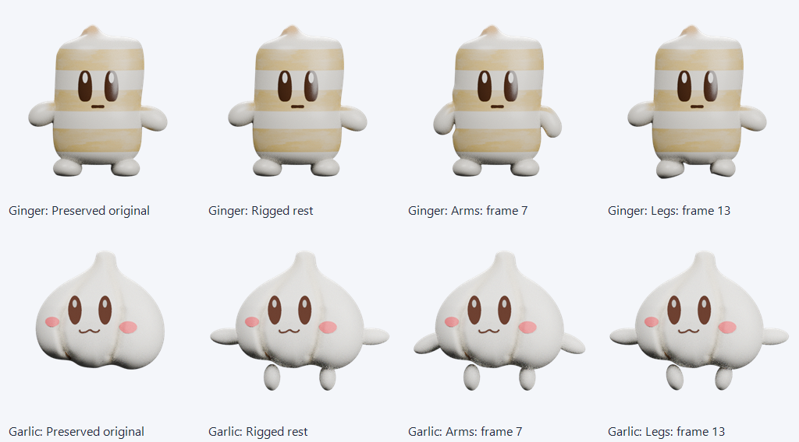
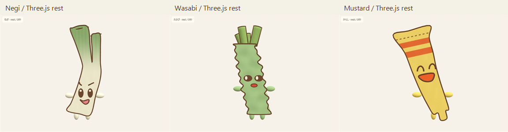
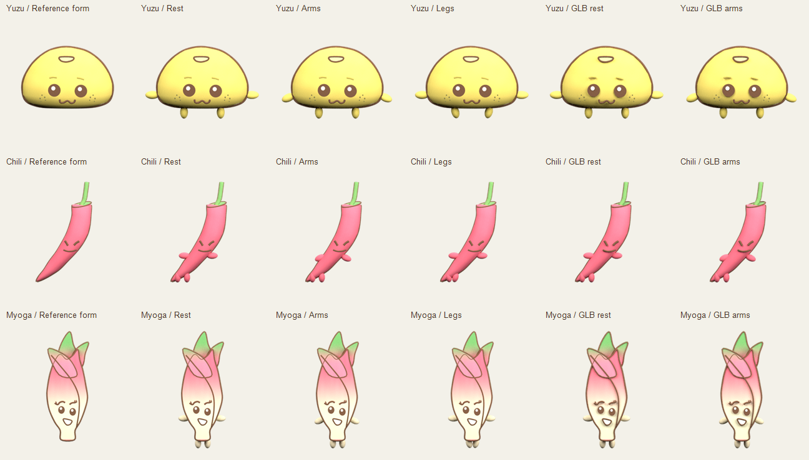
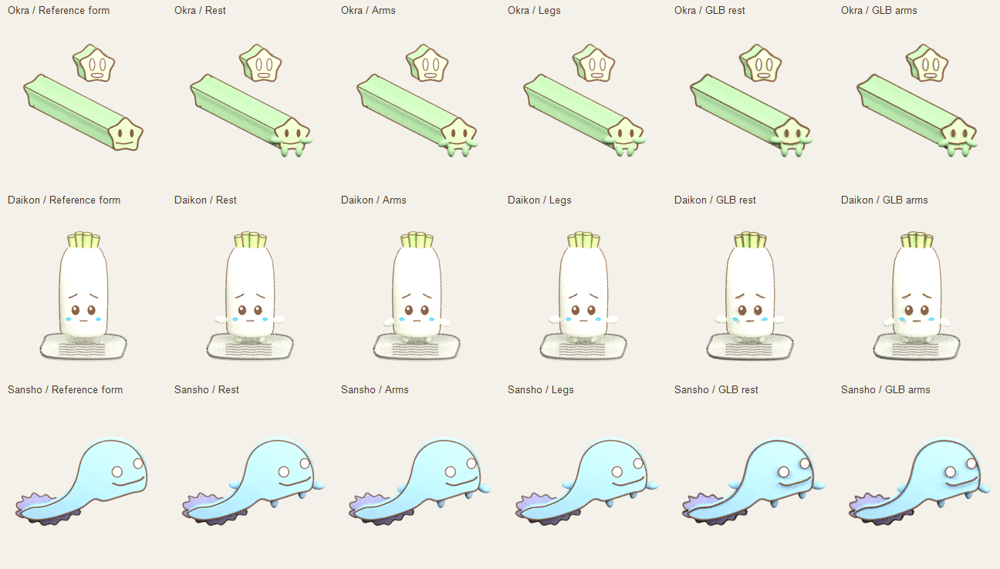

# やくみ組 3Dモデル

しょうがちゃん・にんにくの既存完成モデルを可動化した2体と、新しく制作した追加キャラクター9体を配布しています。しょうがはGinger v20、にんにくはGarlic v14の外観を維持しています。追加9体は原画の輪郭と表情を参照し、厚みのある編集可能なメッシュと、新しい色鉛筆風の塗装を制作しました。

**モデル・材質・リグ・オリジナル動作・制作スクリプトはCC0です。商用利用、改変、再配布を許可します。クレジット表記は任意です。** 同梱Three.jsのコードはMITライセンスです。

## ダウンロード

2つのReleaseは別のモデルセットです。それぞれのZIPを展開してください。Blenderファイル、GLB、テクスチャ、短い動作確認MP4、プレビュー、操作説明、制作コードと検証結果を同梱しています。

| モデルセット | 内容 | ダウンロード |
|---|---|---|
| 既存完成版2体の可動版 | しょうがちゃん・にんにく | [v1.1.0](https://github.com/Cosm0rder/yakumigumi-3d-models/releases/tag/v1.1.0) |
| 追加キャラクター9体 | 下記3バッチ | [v1.0.0](https://github.com/Cosm0rder/yakumigumi-3d-models/releases/tag/v1.0.0) |

追加9体のフォルダー構成：

| フォルダー | キャラクター |
|---|---|
| `batch-01-negi-wasabi-mustard` | ねぎ・わさび・からし |
| `batch-02-yuzu-chili-myoga` | ゆず・唐辛子・みょうが |
| `batch-03-okra-daikon-sansho` | オクラ・大根おろし・サンショウ |

## プレビュー

しょうがちゃん・にんにくのBlenderプレビューです。元の外観、可動版の休止、腕、脚の順です。にんにくの追加手足は表示を切り替えられます。



追加9体のプレビューです。1枚目は最終GLB3体のThree.js全身表示、2・3枚目はBlenderでの手足なし・休止・腕・脚・GLB再読込の比較です。







## しょうがちゃん・にんにくをBlenderで使う

1. v1.1.0の `models/Ginger_rigged.blend` または `models/Garlic_rigged.blend` をBlender 4.3.2以降で開きます。
2. `Ginger_Rig` / `Garlic_Rig` を選びPose Modeにします。`root`、`body`、`arm.L` / `arm.R`、`leg.L` / `leg.R` の6本がFKコントロールです。手足を回すときはGlobal座標で `R` → `Y`、全身の移動は `root` を使います。
3. `Ginger_FK_motion_check` / `Garlic_FK_motion_check` を再生します。12 fps・2秒で、frame 1/25は休止、7は腕、13は脚、19は手足の組み合わせです。自分の動作を作るときはActionを複製するか新しいActionへ切り替えてください。

しょうがは既存の手足・本体・顔・塗装を保持しています。にんにくも既存の本体・顔・塗装を保持し、新しい丸い手足だけを `ADDED LIMBS - toggle viewport and render` Collectionへ追加しています。Outlinerで画面表示とレンダー表示をオフにすると、元の手足なし外観になります。細かな操作はv1.1.0の `docs/RIG_USAGE.md` を参照してください。

元の外観・材質・表情編集の基準は `.blend` です。しょうがの既存shape keys、にんにくの顔コントローラーと6本のscaleドライバーをBlender内に保持しています。にんにくの表情ドライバーはGLBへ移植せず、GLBは初期表情の評価済みメッシュです。GLBにはスキンと2秒の手足アニメを格納し、元の色をベイクした頂点色とPBR材質で近似しています。procedural bump・可変roughness・subsurface・照明や色管理による見た目まで同一にはなりません。この2体はBlenderで保存後の再読込とGLB再読込を検証しています。公開後には、配布済みGLBをThree.js r180でも検証しました。

## しょうがちゃん・にんにくをThree.jsで使う

v1.1.0の公開後に、元のReleaseを変更せず、別途 [viewer/](viewer/) と [original_pair_threejs_validation.json](original_pair_threejs_validation.json) を追加しました。公開GLBのSHA256と読込バイト列を照合し、両モデルの16項目の動作検証、再生・停止、カメラ操作と画面幅変更を確認しています。

1. このリポジトリの **Code → Download ZIP** からソースをダウンロードして展開します。モデルは上記v1.1.0のRelease ZIPを別に展開してください。
2. ターミナルで展開したソースのルートへ移動し、次を実行します。

   ```sh
   cd viewer
   python -m http.server 8000 --bind 127.0.0.1
   ```

3. `http://127.0.0.1:8000/` を開き、ローカルGLBの選択欄からv1.1.0の `glb/Ginger_rigged.glb` または `glb/Garlic_rigged.glb` を選びます。休止・腕・脚の表示とPlay/Stopで手足を確認できます。

この2体のGLBは `COLOR_0` 頂点色を使い、ラスター画像マップは0です。塗装が未読込という意味ではありません。元のPNGは `.blend` 内にパックして保持しています。v1.1.0のZIP内の説明は公開時点のBlender検証を記録したものです。追加9体のv1.0.0とその検証結果は変更していません。

## 追加9体をBlenderで使う

1. 各バッチの `models/*_rigged.blend` をBlender 4.3.2以降で開きます。
2. リグを選びPose Modeに切り替えます。`arm.L` / `arm.R` が腕、`leg.L` / `leg.R` が脚です。`body` と `root` は全体を動かすために使います。
3. 同梱の `*_FK_motion_check` を再生すると手足の動きを確認できます。自分の動作を作るときは、このActionを複製するか新しいActionへ切り替えてください。

追加した短い手足は別Collectionです。Collectionを非表示にすると、原画に近い手足なしの形を確認できます。からしのキャップと中身、オクラの薄切り、大根おろしのおろし板も別オブジェクトです。細かな操作は各バッチの `docs/RIG_USAGE.md` を参照してください。

## 追加9体をThree.jsで使う

GLBにはメッシュ、テクスチャ、6ジョイントのスキンと動作を格納しています。ZIPの展開先でローカルサーバーを起動し、`viewer/` を開くと1体ずつ読み込み・回転・再生・動作検証できます。

```sh
python -m http.server 8000 --bind 127.0.0.1
```

ブラウザーで `http://127.0.0.1:8000/viewer/` を開いてください。Three.jsのGLTFLoaderは骨名の `.` を取り除くため、JavaScript側では `armL` / `armR` / `legL` / `legR` になります。

## 制作と検証

追加9体の生成スクリプトは数式と制御点から形状を作り、固定seedのノイズから塗装を作ります。原画の画像ファイルや既存モデルを読み込みません。Blenderの新しいプロセスでモデルを開き直し、ウェイト、手足の変形、テクスチャ、GLBの再読込を確認しました。Three.jsでも最終GLB9体の休止・腕・脚を実行検証し、読込バイト列のSHA256を配布ファイルと照合しました。モデル別結果はv1.0.0の `runtime_validation.json` にあります。詳しい検証範囲と可動範囲は [VALIDATION.md](VALIDATION.md) と各モデルセットの検証JSONを参照してください。

外観の基準は同梱の `.blend` とそのレンダーです。GLBのPBR材質は光源や表示エンジンによって色・陰影が変わります。操作は6本のFKコントロールで、サンショウの尾は `body` に追従します。

このリポジトリには制作スクリプトを掲載し、完成モデル一式をRelease ZIPとして配布します。再生成する例：

```sh
blender --factory-startup --background --threads 2 --python 01_create_models.py -- --out batch-01-negi-wasabi-mustard --audit local-audit
```

この再生成例は追加9体のバッチ用です。しょうがちゃん・にんにくのv1.1.0は既存完成モデルを新造形で置き換えず、手足の可動化を整えた配布です。
